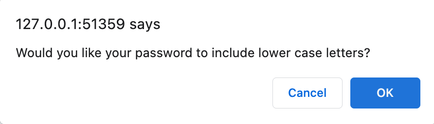

# challenge-3
Password Generator - Challenge 3

This week's Challenge required me to modify starter code to create an application that enables employees to generate random passwords based on criteria that they’ve selected. This app will run in the browser and will feature dynamically updated HTML and CSS powered by JavaScript code that I will write. It will have a clean and polished, responsive user interface that adapts to multiple screen sizes.

## User Story

```
AS AN employee with access to sensitive data
I WANT to randomly generate a password that meets certain criteria
SO THAT I can create a strong password that provides greater security
```

## Acceptance Criteria

```
GIVEN I need a new, secure password
WHEN I click the button to generate a password
THEN I am presented with a series of prompts for password criteria
WHEN prompted for password criteria
THEN I select which criteria to include in the password
WHEN prompted for the length of the password
THEN I choose a length of at least 8 characters and no more than 128 characters
WHEN asked for character types to include in the password
THEN I confirm whether or not to include lowercase, uppercase, numeric, and/or special characters
WHEN I answer each prompt
THEN my input should be validated and at least one character type should be selected
WHEN all prompts are answered
THEN a password is generated that matches the selected criteria
WHEN the password is generated
THEN the password is either displayed in an alert or written to the page
```

## Mock-Up

The following image shows the web application's appearance and functionality:


## Process

First, I created a new GitHub Repository complete with starter code and ensured all assets were in the appropriately labeled folders

Second, I confirmed the CSS sheet and JS file were linked to the HTML correctly and tested the starter code. The HTML page loaded and displayed like the mockup but the red button did not work. The page was responsive to multiple screen sizes.

Then, I reviewed the starter code and instructor-provided pseudo code (below.)

```
function generatePassword(){
  // All your code here
// var numChar = window.prompt
// console.log(numChar);
// var inclNums = window.confirm true/false

// array for each character type
// var numArray = ["0","1"]

// if statement
// var options =[];
  // if true push/concat that array into a new array var

// for loop through options array based on required characters
  // Random index value for every loop
  // Google this; How to randomly choose a value from an array
  // var chosenArr = [];
  // turn array into string

  return password;
}
```
## Results

The application meets most of the Acceptance Criteria. It prompts the user to select password criteria (number of characters, lowercase, uppercase, numeric, and/or special characters,) and it does generate a new password displayed as an alert. This generated password always contains the number of characters specified by the user. However, the generated password does not always contain the expected characters. For example, sometimes the generated password will be only lowercase letters. 

After testing, it appeared the application was generating passwords comprised of only the characters from the user's first selection. For example, if the user answered "No" to lowercase, "No" to uppercase, "Yes" to numbers, and "Yes" to special characters, the generated password would contain only numbers. 

Further testing confirmed that to be true only with passwords under 75 characters. If the user chose passwords with 75 or more characters and chose to include all character types, the application functioned as intended. 

Given the time constraints of this project, I am submitting it "as-is" and will return and troubleshoot once I have more experience with JavaScript.

## Link to Application
https://clvalada.github.io/challenge-3/

## Screenshots

Homepage


Password Generator Length Alert


Password Generator Lowercase Alert


Password Generator Uppercase Alert


Password Generator Number Alert


Password Generator Special Characters Alert


Password Generated


## Resources

I used multiple resources to write the code including:
JavaScript Array Reference: https://www.w3schools.com/jsref/jsref_obj_array.asp

Stack Overflow - random value from JS array: https://www.w3schools.com/jsref/jsref_obj_array.asp

MDN Web Docs JavaScript Reference: https://developer.mozilla.org/en-US/docs/Web/JavaScript/Reference

I used this Repository for inspiration:
https://github.com/manonthemon/Password-Generator

When I got stuck I used this Reddit article for help:
https://www.reddit.com/r/AskProgramming/comments/katbot/javascript_help_with_password_generator/

## Collaborators

None

## License

MIT


